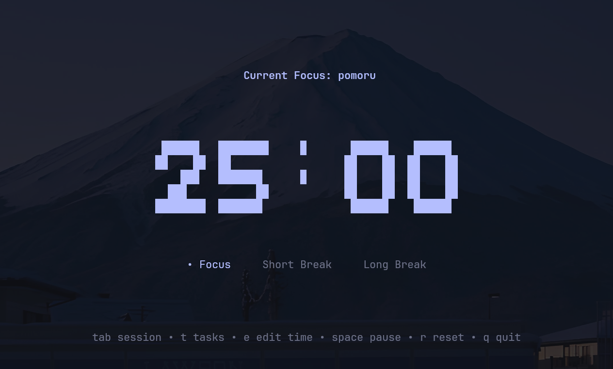
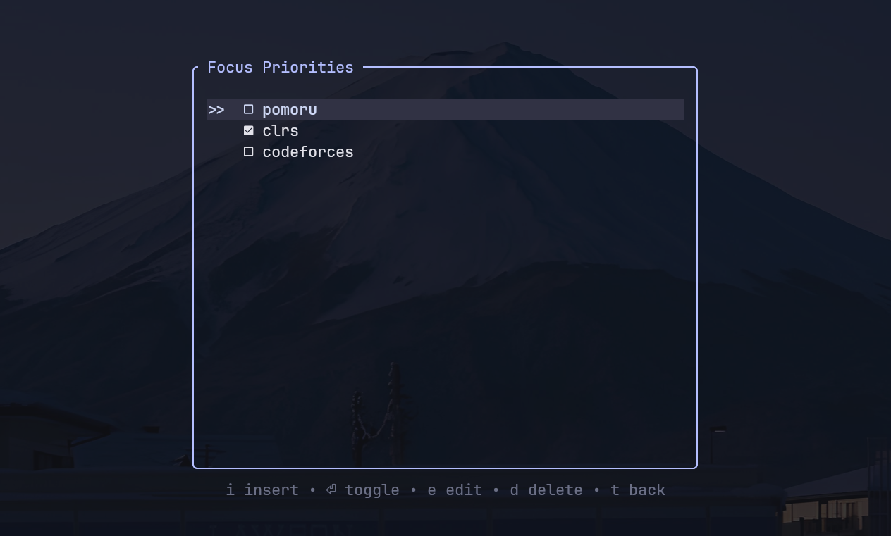
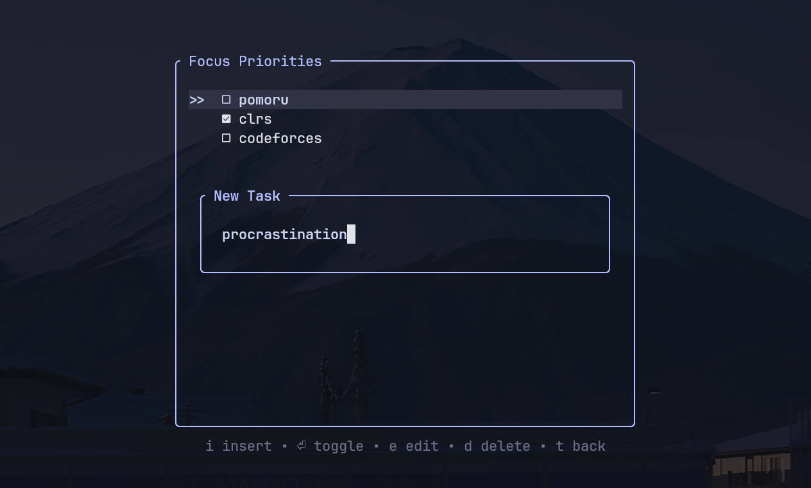

# pomoru

A minimalist Pomodoro TUI with a task list, written in Rust.

`pomoru` is a keyboard-driven TUI application for focused work. It combines a Pomodoro timer with a small task manager so you can track what you’re working on without leaving the terminal.

---

## Features

### Timer

* Work, short break, and long break sessions
* Customizable durations
* Desktop notifications when sessions end

### Tasks

* Add, edit, delete tasks
* Toggle completion
* Task list persists across runs

### Design

* Keyboard-only interaction
* Minimalist interface (Catppuccin Mocha Themed)
* Configuration saved locally

---

## Screenshots





---

## Keybindings

### Timer screen

| Key     | Action                            |
| ------- | --------------------------------- |
| `space` | Start or pause timer              |
| `tab`   | Change session type (when paused) |
| `e`     | Edit current session time         |
| `r`     | Reset timer                       |
| `t`     | Open task list                    |
| `q`     | Quit                              |

### Task screen

| Key         | Action               |
| ----------- | -------------------- |
| `i`         | Add new task         |
| `enter`     | Toggle task done     |
| `e`         | Edit selected task   |
| `d`         | Delete selected task |
| `j` / `↓`   | Move down            |
| `k` / `↑`   | Move up              |
| `t` / `esc` | Back to timer        |

---

## Configuration

`pomoru` saves its state automatically when you quit.

Config file location:

```text
~/.config/pomoru/config.toml
```

Saved data includes:

* Work and break durations
* Task list

Example:

```toml
work_time_mins = 25
short_break_mins = 5
long_break_mins = 15

[[tasks]]
title = "Read documentation"
is_done = false
```

---

## Installation

### Build from source

```bash
git clone https://github.com/RanXom/pomoru
cd pomoru
cargo run --release
```

To install the binary:

```bash
cargo install --path .
```

---

## Built with

* Rust
* ratatui
* crossterm
* tokio
* notify-rust
* serde + toml

---

## License

MIT
