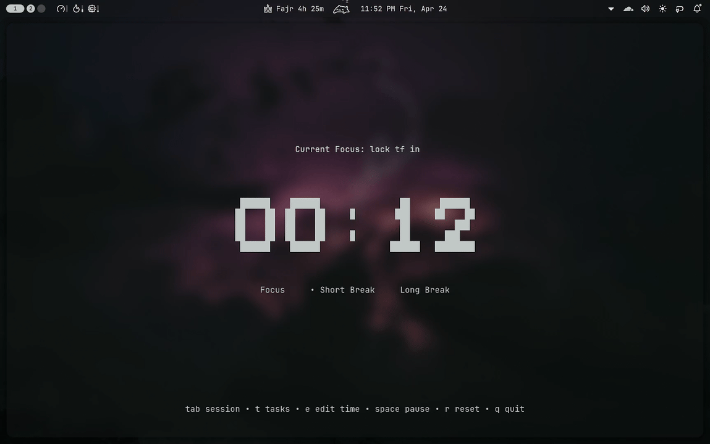

<div align="center">


A minimalist Pomodoro TUI with a task list, written in Rust.


</div>

## Features

### Timer

- Work, short break, and long break sessions
- Customizable durations
- Desktop notifications when sessions end
- Optional automatic session switching
- Manual session progression mode

### Tasks

- Add, edit, delete tasks
- Toggle completion
- Task list persists across runs

### Design

- Keyboard-only interaction
- Minimalist interface
- Dynamic theming via [Noctalia](https://noctalia.dev) (v5 matugen templates + legacy `colors.json`)
- Configuration saved locally

---

## Demo



---

## Keybindings

### Timer screen

| Key     | Action                             |
| ------- | ---------------------------------- |
| `space` | Start or pause timer               |
| `tab`   | Change session type (when paused)  |
| `a`     | Toggle automatic session switching |
| `e`     | Edit current session time          |
| `r`     | Reset timer                        |
| `t`     | Open task list                     |
| `q`     | Quit                               |

### Task screen

| Key         | Action               |
| ----------- | -------------------- |
| `i`         | Add new task         |
| `enter`     | Toggle task done     |
| `e`         | Edit selected task   |
| `d`         | Delete selected task |
| `j` / `↓`   | Move down            |
| `J`         | Move task down       |
| `k` / `↑`   | Move up              |
| `K`         | Move task up         |
| `t` / `esc` | Back to timer        |

---

## Configuration

`pomoru` saves its state automatically when you quit.

Config file location:

```text
~/.config/pomoru/config.toml
```

Saved data includes:

- Work and break durations
- Task list

Example:

```toml
work_time_mins = 25
short_break_mins = 5
long_break_mins = 15
auto_switch_sessions = true

[[tasks]]
title = "Read documentation"
is_done = false
```

---

## Status Export

Pomoru exports its current state to:

```text
~/.cache/pomoru/status.json
```

Example:

```json
{
  "text": "󰄉 Work 24:31",
  "tooltip": "Work",
  "class": "work"
}
```

This can be used by:

- Waybar
- Custom status bars
- Shell scripts
- Desktop widgets

---

### Waybar

The previously stated `status.json` can be used in Waybar as follows:

```json
"custom/pomoru": {
  "exec": "cat ~/.cache/pomoru/status.json",
  "return-type": "json",
  "interval": 1,
  "format": "{text}",
  "tooltip": true
}
```

---

## Theming

Pomoru picks up colors in this priority order:

| Priority | Source | When it applies |
|----------|--------|-----------------|
| 1 | `~/.cache/pomoru/colors.json` | Noctalia v5 user template (recommended) |
| 2 | `~/.config/noctalia/colors.json` | Legacy noctalia v4 format |
| 3 | Built-in defaults | Catppuccin Mocha palette |

### Noctalia v5 — wiring it up

Noctalia v5 uses its own template engine (matugen-compatible `{{colors.<role>.default.hex}}` tokens). When the wallpaper or palette changes, noctalia re-renders all configured templates automatically. Pomoru ships the template and config snippet needed to hook into this system.

**One-time setup:**

```bash
# 1. Copy the input template into noctalia's template directory
mkdir -p ~/.config/noctalia/templates
cp assets/noctalia/colors-template.json \
   ~/.config/noctalia/templates/pomoru-colors.json

# 2. Register the user template in noctalia's config
#    Either append to an existing templates.toml, or create it fresh:
cat assets/noctalia/templates.toml >> ~/.config/noctalia/templates.toml

# 3. Render immediately (no need to change wallpaper)
noctalia msg templates-apply
```

After step 3, `~/.cache/pomoru/colors.json` will exist and pomoru picks it
up on the next launch.

**What noctalia renders** (`assets/noctalia/colors-template.json`):

```json
{
  "primary":            "{{colors.primary.default.hex}}",
  "on_surface_variant": "{{colors.on_surface_variant.default.hex}}",
  "surface_container":  "{{colors.surface_container.default.hex}}",
  "on_surface":         "{{colors.on_surface.default.hex}}"
}
```

**The config block** (`assets/noctalia/templates.toml`) noctalia reads:

```toml
[theme.templates.user.pomoru]
input_path  = "$XDG_CONFIG_HOME/noctalia/templates/pomoru-colors.json"
output_path = "$XDG_CACHE_HOME/pomoru/colors.json"
```

> **Note:** `$XDG_CONFIG_HOME` defaults to `~/.config` and `$XDG_CACHE_HOME`
> defaults to `~/.cache`. Noctalia v5 expands these automatically.

> **Coming from noctalia v4?** Delete the stale files from `~/.config/noctalia/`:
> - `colors.json` — not read by v5
> - `user-templates.toml` — uses matugen's old `[templates.*]` schema; v5 will
>   warn `templates: unknown section` and ignore it. The v5 schema is
>   `[theme.templates.user.*]` in any `*.toml` under `~/.config/noctalia/`.

**Validate your config:**

```bash
noctalia config validate ~/.config/noctalia/templates.toml
# → ✓ Config is valid
```

**Re-apply without changing wallpaper:**

```bash
noctalia msg templates-apply
```

### Legacy noctalia (v4)

No setup required. If `~/.config/noctalia/colors.json` exists and
`~/.cache/pomoru/colors.json` does not, pomoru reads the legacy camelCase
format automatically. Delete it once you've set up the v5 template above.

---

## Installation

### Prebuilt binary

Download from the releases page:

https://github.com/RanXom/pomoru/releases

```bash
tar -xvf pomoru-1.0.0-x86_64.tar.gz
cd pomoru-1.0.0-x86_64
./pomoru
```

To install globally:

```bash
cd pomoru-1.0.0-x86_64
sudo cp pomoru /usr/local/bin/
pomoru
```

### Arch Linux (AUR)

```bash
yay -S pomoru        # build from source
yay -S pomoru-bin    # prebuilt binary
```

### Build from source

```bash
git clone https://github.com/RanXom/pomoru
cd pomoru
cargo run --release
```

To install the binary locally:

```bash
cargo install --path .
```

---

## Built with

- Rust
- ratatui
- crossterm
- tokio
- notify-rust
- serde + toml

---

## License

MIT
